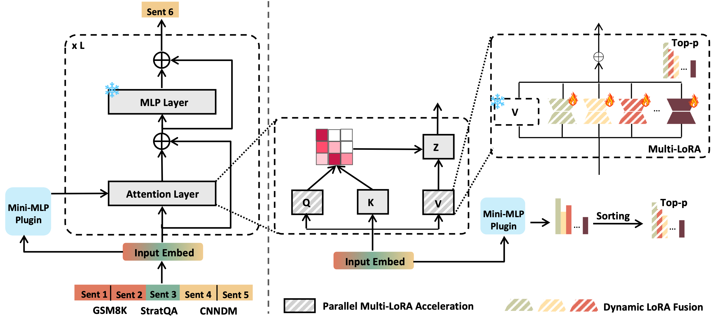

# DLP-LoRA

<p align="center">

</p>

TL;DR: We introduce DLP-LoRA, a dynamic and lightweight plugin that uses a mini-MLP to efficiently fuse multiple LoRAs at the sentence level in large language models. Evaluated across 26 tasks, DLP-LoRA matches or surpasses single-task LoRA performance while maintaining efficient inference times, effectively balancing performance and efficiency for dynamic multi-task adaptation.

[arXiv:..................](#)

## DLP-LoRA Quick Start

### 1. Prepare LLMs & Classifier Model

- First, choose the LLM you would like to use and place it in `./BasicModel/LLMs`. You can obtain `albert` and `roberta-distil` through Hugging Face.

### 2. Prepare Datasets

- To train your own LoRA or test your DLP-LoRA, you need to preprocess your datasets into JSON format, structured as a DictList, where each dictionary contains keys "Q" and "A". Then inject them into the Datasets.

## DLP-LoRA Gradio Usage

### Basic Page

#### 1. Basic LoRA Training

On this page, you can test basic models and train LoRA by filling in the required fields.

**Important Notes**:
- Regardless of the mode you're using, make sure to change the `src.Process.to_one_hot`'s `vocab_size` to match the vocab size of your LLM.
- Since different LLMs have varying end tokens, you also need to update `src.Process.generate_text` with the correct token ID for your model’s end token (this part may require editing as it’s not the latest version developed).

**JSON Format**:  
- The format is `DictList`, where each dictionary contains keys "Q" and "A".

**While Training or Testing**:
- You may need to fill the Datasets Path with the correct JSON file, and if you are using the testing mode of the Basic model, then you can fill the LoRA path with anything you like.

**Outputs**:
1. **ModelOutput**:
   - The model will output to `./finish/lora`, where you can find your LoRA model.

2. **TestDataOutput**:
   - The test data will output to `./TestOutputs`, where you can find your test feedback.

#### 2. Classifier Training

On this page, you can train your own Classifier by choosing different models (`albert`, `roberta-base-distil`, or `MLP`).

**Important Notes**:
- The datasets used for training LoRA can be fully utilized by the Classifier. You can use Page 3, `Classifier datasets maker Fusion`, to convert your LoRA datasets into Classifier datasets.

- Only datasets formed in the correct format from Page 3 can be used to train the classifier; more details are provided in the code.

**While Training or Testing**:
- You may need to fill the Datasets Path with the correct JSON file, and if you are using the testing mode of the Basic model, then you can fill the LoRA path with anything you like.

**Outputs**:
1. **ModelOutput**:
   - The model will output to `./finish/Classifier`, where you can find your Classifier model.

#### 3. Classifier Datasets Maker Fusion

On this page, you can convert your LoRA datasets into Classifier datasets.

**How to Use**:
1. The datasets used for training LoRA can be fully utilized by the Classifier. You just need to place your LoRA datasets, keeping the same format as Page 1, and click start to output them to your folder.

2. Since you are training the classifier, we designed the fusion function to help you combine different datasets.

- Note: It is better to sample the same number of datasets for better feedback.

#### 4. DLP-LoRA Test

Once you have your LoRA and Classifier, it’s time to start DLP-LoRA.

**How to Use**:
1. First, create a `LoRA pathList.txt` and input it into the provided space for our model to find your LoRAs.

2. Then, choose the type of your classifier and fill in the other paths following the page’s order.

3. After filling in all the fields, click start to begin testing your DLP-LoRA.

**JSON Format**:  
- The format is `DictList`, where each dictionary contains keys "Q" and "A".

**Outputs**:
1. **TestDataOutput**:
   - The test data will output to `./TestOutputs`, where you can find your DLP-LoRA test feedback.


**Notice the empty folder will not show in Github**
```
├── BasicModel
│   ├── Classifiers
│   └── LLMs
├── DataSets
├── DCLLGradio.py
├── finish
│   ├── Classifier
│   └── lora
├── LoRAdicts
├── LoRA_models
│   └── formList.py
├── model
├── PrintDict.py
├── ReadMe.md
├── src
│   ├── ClassifierUtilities.py
│   ├── Criterion.py
│   ├── DCLL.py
│   ├── Evaluation.py
│   ├── Get_data.py
│   ├── LoraModel.py
│   ├── Process.py
│   ├── train.py
│   ├── __init__.py
│   └── __pycache__
│       ├── Add_mask.cpython-310.pyc
│       ├── Add_mask.cpython-38.pyc
│       ├── Add_mask.cpython-39.pyc
│       ├── Berts.cpython-310.pyc
│       ├── Berts.cpython-38.pyc
│       ├── Berts.cpython-39.pyc
│       ├── ClassifierUtilities.cpython-38.pyc
│       ├── Criterion.cpython-310.pyc
│       ├── Criterion.cpython-38.pyc
│       ├── Criterion.cpython-39.pyc
│       ├── DCLL.cpython-311.pyc
│       ├── DCLL.cpython-38.pyc
│       ├── Evaluation.cpython-310.pyc
│       ├── Evaluation.cpython-38.pyc
│       ├── Evaluation.cpython-39.pyc
│       ├── Get_data.cpython-310.pyc
│       ├── Get_data.cpython-38.pyc
│       ├── Get_data.cpython-39.pyc
│       ├── LoraModel.cpython-38.pyc
│       ├── PictureDrawer.cpython-38.pyc
│       ├── Process.cpython-38.pyc
│       ├── Processing.cpython-310.pyc
│       ├── Processing.cpython-38.pyc
│       ├── Processing.cpython-39.pyc
│       ├── train.cpython-311.pyc
│       ├── train.cpython-38.pyc
│       ├── train.cpython-39.pyc
│       ├── Train_mode.cpython-310.pyc
│       ├── Train_mode.cpython-38.pyc
│       ├── Train_mode.cpython-39.pyc
│       ├── Transform_parameters.cpython-310.pyc
│       ├── Transform_parameters.cpython-38.pyc
│       ├── Transform_parameters.cpython-39.pyc
│       ├── __init__.cpython-310.pyc
│       ├── __init__.cpython-311.pyc
│       ├── __init__.cpython-38.pyc
│       └── __init__.cpython-39.pyc
├── srcClassifier
│   ├── ClassifierDatasetsMaker.py
│   ├── ClassifierModel.py
│   ├── Criterion.py
│   ├── evaluation.py
│   ├── GetDatasets.py
│   ├── Get_data.py
│   ├── Process.py
│   ├── Trainer.py
│   ├── __init__.py
│   └── __pycache__
│       ├── Add_mask.cpython-310.pyc
│       ├── Add_mask.cpython-38.pyc
│       ├── Add_mask.cpython-39.pyc
│       ├── Berts.cpython-310.pyc
│       ├── Berts.cpython-38.pyc
│       ├── Berts.cpython-39.pyc
│       ├── ClassifierModel.cpython-311.pyc
│       ├── ClassifierModel.cpython-38.pyc
│       ├── Criterion.cpython-310.pyc
│       ├── Criterion.cpython-38.pyc
│       ├── Criterion.cpython-39.pyc
│       ├── Evaluation.cpython-310.pyc
│       ├── evaluation.cpython-38.pyc
│       ├── Evaluation.cpython-39.pyc
│       ├── GetDatasets.cpython-38.pyc
│       ├── Get_data.cpython-310.pyc
│       ├── Get_data.cpython-38.pyc
│       ├── Get_data.cpython-39.pyc
│       ├── LoraModel.cpython-38.pyc
│       ├── Process.cpython-38.pyc
│       ├── Processing.cpython-310.pyc
│       ├── Processing.cpython-38.pyc
│       ├── Processing.cpython-39.pyc
│       ├── train.cpython-311.pyc
│       ├── train.cpython-38.pyc
│       ├── train.cpython-39.pyc
│       ├── Trainer.cpython-38.pyc
│       ├── Train_mode.cpython-310.pyc
│       ├── Train_mode.cpython-38.pyc
│       ├── Train_mode.cpython-39.pyc
│       ├── Transform_parameters.cpython-310.pyc
│       ├── Transform_parameters.cpython-38.pyc
│       ├── Transform_parameters.cpython-39.pyc
│       ├── __init__.cpython-310.pyc
│       ├── __init__.cpython-311.pyc
│       ├── __init__.cpython-38.pyc
│       └── __init__.cpython-39.pyc
├── startGradio.bat
├── TestOutputs
│   └── Fusion
└── __pycache__
    ├── DCLL.cpython-311.pyc
    └── DCLL.cpython-38.pyc```
